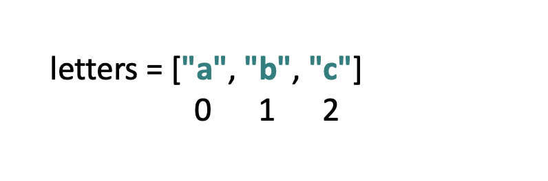

### lists are arrays in pretty much every other language 
all about data management 

to make a  list it needs to be `variable name = []`
use `print(type(variable name)` to work out what type you are using

use `print(variable name[number of the item needed starts with 0]`

Tuples same as lists, except they are immutable (you cant change any of the data from the list)

to create a tuple you need to use `variable name = (List in here)`

list slicing 

- `print(mixture[1:3])` shows the list from the first to second number. 

- `print(mixture[-2::])` double colon reverses the order.

- `print(mixture[::2])`  bounces over the amount of indexes specified